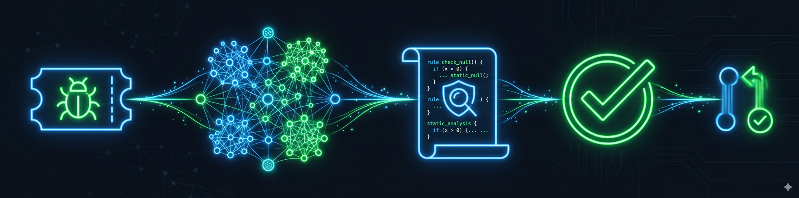

<p align="center">
  
</p>

<p align="center">
  <a href="https://github.com/Tamircohen28"></a>
  <a href="https://github.com/Tamircohen28/repo-bug-learner/actions/workflows/ci.yml"></a>
  <a href="LICENSE"></a>
  <a href="pyproject.toml"></a>
</p>

<p align="center">
  <a href="docs/engineering/build-and-release/platform-targets.json"></a>
  <a href="docs/engineering/build-and-release/platform-targets.json"></a>
  <a href="docs/engineering/build-and-release/platform-targets.json"></a>
</p>

# repo-bug-learner

Mine historical bug-fix commits from Jira + GitHub, cluster recurring patterns, synthesize **Scalafix** (Scala) and **Opengrep** (TypeScript, JavaScript, Python, Go) rules, validate them against a held-out corpus, and ship them as PRs to a rules repository that gates future PRs via CI.

## Feature highlights

- **Language-aware synthesis** — Scala clusters become Scalafix rules; TS/JS/Python/Go clusters become Opengrep YAML rules
- **Configurable mining** — any Jira project + GitHub org; ticket pattern and repo list in `config.toml`
- **Validation loop** — precision/recall thresholds before auto-shipping rules
- **PR review skill** — Claude Code skill at `.claude/skills/repo-bug-review/` for scanning local code or GitHub PRs
- **CI templates** — copy workflows from `service-integration/` into any target repo
- **Continuous learning** — batch bootstrap plus optional per-bug continuous loop

## Prerequisites

- Python 3.11+
- Docker (Postgres + pgvector via `docker compose up -d`)
- [uv](https://github.com/astral-sh/uv) or pip
- Jira + GitHub API credentials
- Anthropic API key (or compatible endpoint)

## Quick Start

```bash
make install
cp config/config.example.toml config/config.toml
# Edit config.toml — Jira URL, GitHub org, repos, Claude base_url

export JIRA_USER=... JIRA_TOKEN=... GITHUB_TOKEN=... ANTHROPIC_API_KEY=...

docker compose up -d
python -m src.orchestrator schema
python -m src.orchestrator batch --repo backend --since 2024-05-01 --output out/
make test
```

### Claude Code

Open the repo in Claude Code — `CLAUDE.md` imports `AGENTS.md`. Project skill:
`.claude/skills/repo-bug-review/`.

```bash
make install
make update    # refresh deps after pulling main
```

### Cursor

Rules live in `.cursor/rules/000-project.mdc` (points to `AGENTS.md`). Portable skills:
`.agents/skills/`.

```bash
make install
make update
```

### Codex

Codex reads root `AGENTS.md` for repo policy. Portable skills: `.agents/skills/`.

```bash
make install
make update
```

## Makefile lifecycle

| Target | Purpose |
|--------|---------|
| `make install` | First-time setup (`uv sync --extra dev`) |
| `make update` | Refresh dependencies after pulling changes |
| `make uninstall` | Remove local venv and generated caches |

## Documentation

See [docs/README.md](docs/README.md) for the full doc map.

## Contributing

See [docs/CONTRIBUTING.md](docs/CONTRIBUTING.md).

## License

MIT — see [LICENSE](LICENSE).
